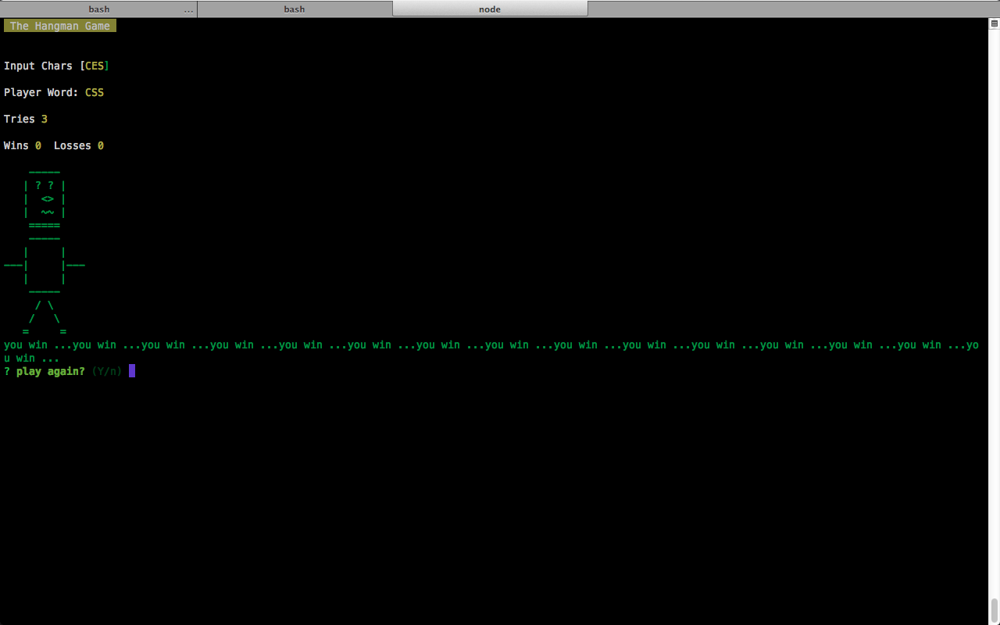
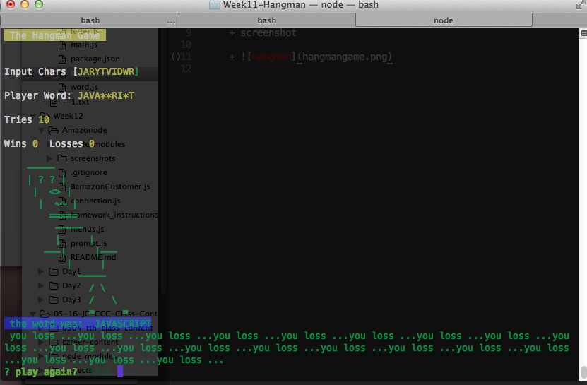

# Hangman Game
Hangman game that runs entirely with Node.js, keeps track of input letters, wins, losses and 
number of tries

Screenshot of its functionality is shown below:

1. Hangman Win
    + Word to guess css

    + 

1. Hangman Lose
    + Word to guess javascript

    + 
